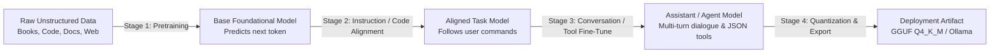
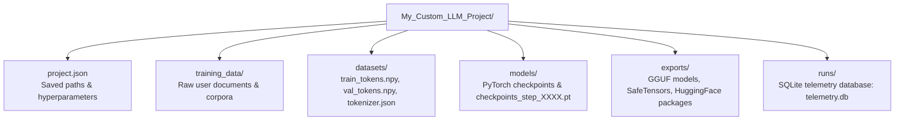
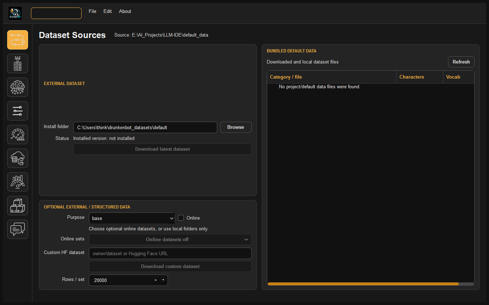
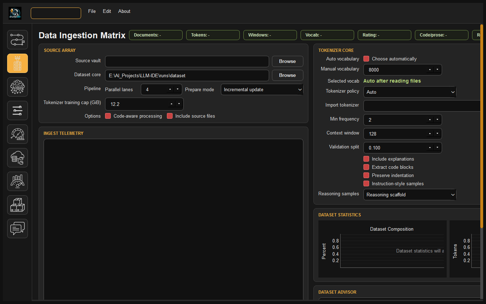
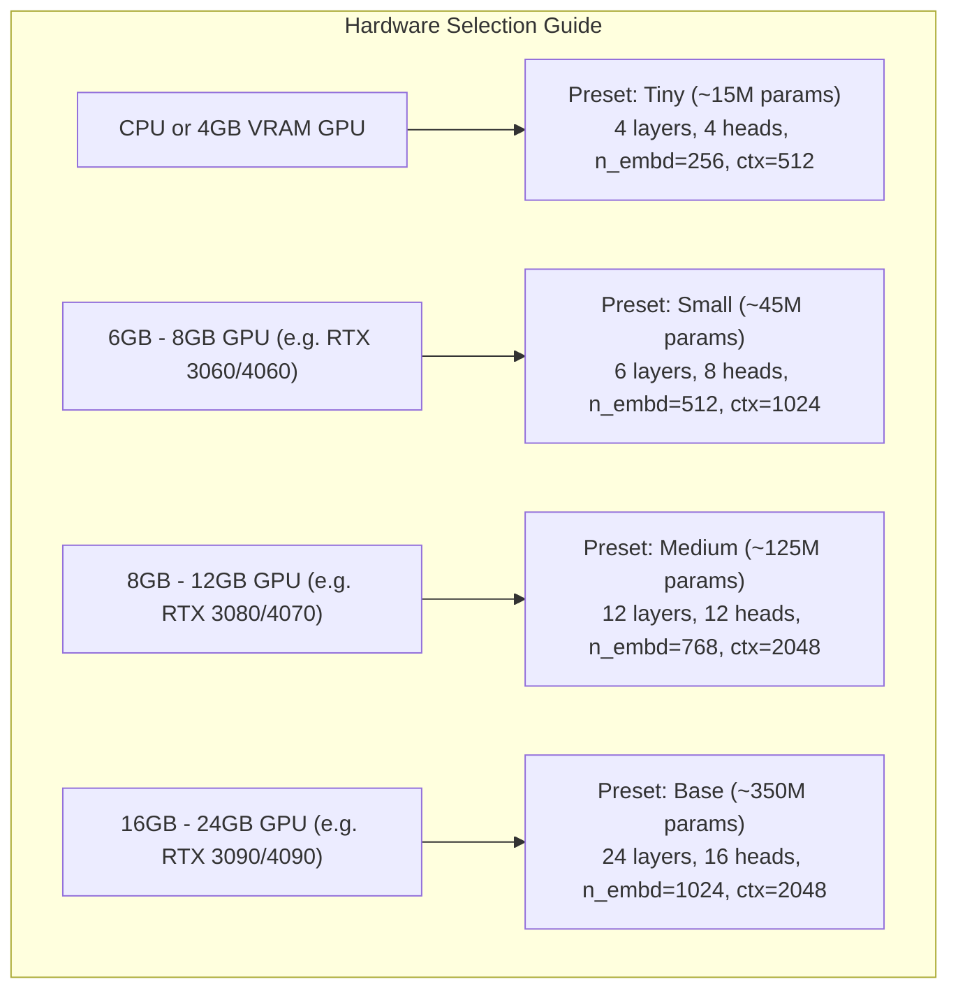
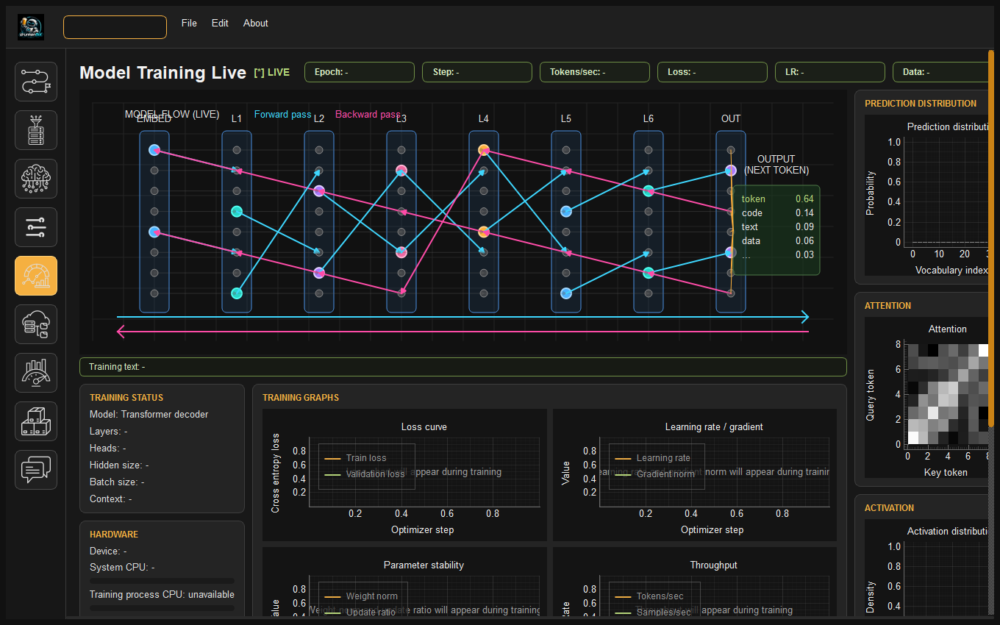
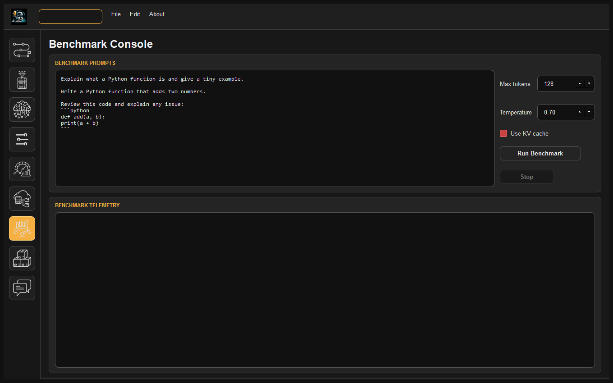
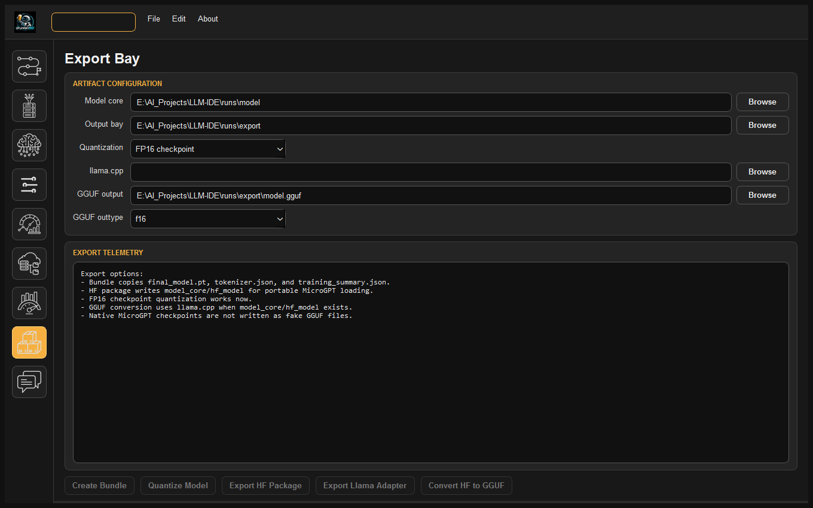

# How to Train Your LLM: The Complete Practical Handbook
### A Step-by-Step Field Guide to Creating, Fine-Tuning, and Deploying Custom Language Models Locally

---

## Welcome to Local LLM Development

Building a custom Large Language Model (LLM) was once restricted to mega-corporations with multi-million-dollar compute clusters. **DrunkenBot LLM-IDE** changes that paradigm completely: it allows developers, data scientists, and AI researchers to design, train, align, and quantize proprietary generative language models entirely on their own workstation.

Whether your goal is to build a domain-specialized code assistant, a private medical or legal document synthesizer, or a lightweight conversational companion, this handbook will guide you step-by-step from zero to a fully deployed GGUF model running locally.

---

## Table of Contents
- [Phase 0: Mental Model & Core Concepts](#phase-0-mental-model-core-concepts)
- [Phase 1: Project Setup & Workspace Initialization](#phase-1-project-setup-workspace-initialization)
- [Phase 2: Gathering & Preparing Your Data](#phase-2-gathering-preparing-your-data)
- [Phase 3: Pretraining Your Base Model From Scratch](#phase-3-pretraining-your-base-model-from-scratch)
- [Phase 4: Post-Training Alignment & Fine-Tuning (LoRA & PEFT)](#phase-4-post-training-alignment-fine-tuning-lora-peft)
- [Phase 5: Benchmarking & Evaluating Performance](#phase-5-benchmarking-evaluating-performance)
- [Phase 6: Exporting & Real-World Deployment (GGUF & Chat)](#phase-6-exporting-real-world-deployment-gguf-chat)
- [Phase 7: Troubleshooting & Common Pitfalls](#phase-7-troubleshooting-common-pitfalls)

---

## Phase 0: Mental Model & Core Concepts

Before launching your first training run, it is vital to understand the multi-stage lifecycle of modern generative models:



### 1. Tokens vs. Words
Neural networks do not process raw text or strings directly. Text is converted into integers ("token IDs") via a **Byte-Pair Encoding (BPE) Tokenizer**.
- $1 \text{ token} \approx 0.75 \text{ English words}$ (or roughly $3.5$ to $4$ characters).
- For programming code, tokens represent keywords (`def`, `class`, `import`), indentation blocks, or punctuation operators (`->`, `::`, `!=`).

### 2. Context Length
The context length (e.g. 512, 1024, 2048, or 4096 tokens) represents the model's instantaneous working memory. 
- Memory consumption in standard self-attention scales quadratically ($\mathcal{O}(N^2)$) with context length.
- Double the context length quadruples attention memory requirements. Keep context lengths reasonable (512–1024 for small models; 2048–4096 for larger models).

### 3. Training Loss vs. Validation Loss
- **Training Loss**: How well the model predicts the next token on the data it is actively studying.
- **Validation Loss**: How well the model predicts tokens on unseen test documents held in reserve.
- **Ideal Curve**: Both curves decrease smoothly in tandem.
- **Overfitting**: Training loss drops very low (e.g. $< 1.0$), but validation loss starts rising. The model has memorized the training text rather than learning underlying concepts.

---

## Phase 1: Project Setup & Workspace Initialization

DrunkenBot LLM-IDE uses a project-based workspace where all raw data, tokenizers, checkpoints, telemetry logs, and exported binaries are self-contained.



### Step-by-Step Setup:
1. Launch DrunkenBot LLM-IDE:
   ```bash
   python run_app.py
   ```
2. The startup splash screen validates your installation. When the **Project Chooser** dialog appears:
   - Click **New Project**.
   - Enter a human-readable project name (e.g. `CodeForge-350M` or `LegalBot-45M`).
   - Select a destination folder on your fastest SSD.
3. Click **Save Project** (or press `Ctrl+S`). The IDE automatically creates the directory hierarchy shown above.

---

## Phase 2: Gathering & Preparing Your Data

Data quality is the single most important factor determining model intelligence. High-quality, clean data always outperforms massive, noisy data.

### 1. Preparing Datasets by Stage

| Dataset Kind | File Format | Format Structure | Primary Purpose |
| :--- | :--- | :--- | :--- |
| **Base Pretraining** | `.txt`, `.md`, `.pdf` | Freeform text, technical documentation, books | Teaches grammar, reasoning, vocabulary, and syntax. |
| **Instruction** | `.jsonl` | `{"instruction": "...", "input": "...", "output": "..."}` | Teaches prompt-following and task execution. |
| **Conversation** | `.jsonl` | `{"messages": [{"role": "system", ...}, {"role": "user", ...}, {"role": "assistant", ...}]}` | Teaches multi-turn dialogue, tone, and character. |
| **Code** | `.jsonl` / `.py` / `.cpp` | Preserved indentation with docstrings & solutions | Teaches code generation, refactoring, and debugging. |
| **Tool-Call** | `.jsonl` | Functions schema with structured JSON arguments | Teaches tool invocation and API orchestration. |

### 2. Using the Dataset Blueprint Tab (`IN`)



1. Navigate to **Dataset Blueprint** (the first icon in the left navigation sidebar).
2. Copy your raw files into `your_project/training_data/` or click **Browse** to point to an external directory.
3. Review the categorized document tree:
   - The blueprint calculates estimated token counts, character volume, and vocabulary density.
   - You can uncheck categories or documents you wish to exclude.

### 3. Ingestion & Tokenizer Configuration



1. Click the **Ingestion** icon (second icon in the sidebar).
2. Configure your Tokenizer settings:
   - **Vocabulary Size**: 
     - Small domain models (15M–45M): `4,096` to `8,192` tokens.
     - General or Code models (120M–350M): `16,384` to `32,000` tokens.
   - **Context Length**: Select your target sequence window (e.g. `512`, `1024`, or `2048`).
   - **Validation Split Ratio**: Default `0.05` (5% held out for unbiased validation loss).
3. **Prompt Loss Masking**: Ensure prompt loss masking is enabled if building instruction, dialogue, code, or tool-calling sets. The engine automatically marks prompt spans with `-100` (`IGNORE_INDEX`).
4. Click **Build Dataset**. The engine will train the BPE tokenizer and compile binary memory maps:
   - `train_tokens.npy`
   - `val_tokens.npy`
   - `train_targets.npy` (with masked prompts)
   - `val_targets.npy`

---

## Phase 3: Pretraining Your Base Model From Scratch

Once your dataset is compiled, navigate to the **Neural Forge** tab (third icon in the sidebar).


### 1. Selecting Model Architectural Dimensions

Choose an architecture preset that fits your hardware:



### 2. Hyperparameter Configuration
- **Block Style**: Modern LLaMA-style (RMSNorm + SwiGLU) is strongly recommended over Classic GPT.
- **RoPE Base Theta**: Set to `10000.0` for short context ($\le 2048$) or `50000.0` for long context ($4096+$).
- **Learning Rate**:
  - Tiny/Small: `5e-4` ($0.0005$)
  - Medium/Base: `3e-4` ($0.0003$)
- **Learning Rate Schedule**: `Warmup Linear` with $500$ to $1,000$ warmup steps.
- **Weight Decay**: `0.1` (AdamW decoupled weight decay prevents weight explosion).
- **Precision**: Set to **Mixed Precision (AMP FP16)** for $2\times$ faster training and $50\%$ VRAM reduction.

### 3. Launching Training & Live Monitoring
Click **Start Training**. The IDE starts a detached background worker process.

Navigate to the **Live Telemetry** tab (fifth icon):



- **Training Curve**: Watch the gold/blue loss curve. Good pretraining typically begins at loss $\approx 10.0$ and converges down toward $2.5$ – $1.8$.
- **Validation Loss**: Checked automatically every 100 steps. As long as validation loss decreases alongside training loss, the model is acquiring generalized intelligence.
- **Safety**: You can safely close the IDE window! The worker keeps computing. When you reopen the IDE, it reattaches automatically.

---

## Phase 4: Post-Training Alignment & Fine-Tuning (LoRA & PEFT)

Once pretraining finishes (or if adapting an existing base checkpoint), open the **Fine-Tuning Lab** (fourth icon).


### 1. Choosing Your Adaptation Kind
- **Instruction Fine-Tuning**: Teaches the model to act upon commands and answer direct questions.
- **Conversation Fine-Tuning**: Trains multi-turn dialogue capability with pinned system prompts.
- **Code Fine-Tuning**: Trains the model on programming syntax, functions, and docstrings.
- **Tool-Call Fine-Tuning**: Trains the model to emit JSON schemas for external API calling.

### 2. Full Fine-Tuning vs. LoRA

| Feature | Full Fine-Tuning | LoRA (Low-Rank Adaptation) |
| :--- | :--- | :--- |
| **VRAM Usage** | High ($3\times$ model weight memory) | Very Low ($\approx 20\%$ extra memory) |
| **Speed** | Standard | $2\times$ faster backpropagation |
| **Catastrophic Forgetting** | Risk of degrading base knowledge | Base weights are frozen; zero degradation |
| **Recommended When** | Training small models ($< 50\text{M}$) | Training larger models ($> 100\text{M}$) or code |

### 3. LoRA Configuration Rules of Thumb
- **LoRA Rank ($r$)**: `16` is ideal for general instruction; `32` for complex code.
- **LoRA Alpha ($\alpha$)**: Set to $2 \times r$ (e.g. rank `16` $\rightarrow$ alpha `32.0`).
- **LoRA Target Modules**:
  - For standard conversation: **Attention projections** (`q, k, v, out`).
  - For code & tool calling: **Attention + MLP** (`w1, w2, c_fc, c_proj`). Code logic requires MLP representational capacity!
- Click **Apply Recommended LoRA** to automatically configure optimal settings for your selected task.

---

## Phase 5: Benchmarking & Evaluating Performance

Before deploying, benchmark your checkpoint to evaluate perplexity, latency, and response quality.



1. Open the **Benchmarks** tab (seventh icon).
2. Select your checkpoint from `models/`.
3. Select your benchmark suite:
   - **Reasoning**: Multi-step logic puzzles and math problems.
   - **Coding**: Algorithm implementations, syntax completion, docstrings.
   - **General Knowledge**: Factual recall and summarization.
4. Click **Run Benchmark**. The benchmark engine reports:
   - **Perplexity**: Lower is better ($\le 12.0$ represents strong comprehension).
   - **Inference Speed**: Tokens per second generated on host hardware.
   - **Output Fidelity**: Side-by-side prompt responses across training checkpoints.

---

## Phase 6: Exporting & Real-World Deployment (GGUF & Chat)

### 1. Exporting Your Model in the Export Bay



1. Open the **Export Bay** tab (eighth icon).
2. Choose your target distribution format:
   - **HuggingFace Transformers**: Exports `model.safetensors` and `config.json` for deployment with HuggingFace Hub, vLLM, or TGI.
   - **Quantized FP16**: Halves file size while retaining native PyTorch compatibility.
   - **GGUF Conversion**: Compiles directly into quantized GGUF format for `llama.cpp`.
3. Select your GGUF Quantization type:
   - `f16`: Unquantized full precision (fastest on high-end GPUs with ample VRAM).
   - `q8_0`: 8-bit integer quantization (indistinguishable quality from FP16, $50\%$ smaller).
   - `q4_k_m`: 4-bit medium k-quantization (the industry standard for consumer desktop and laptop deployment).
4. Click **Convert to GGUF**. The compiled binary is saved in your project's `exports/` folder.

### 2. Testing in the Built-in Chat Studio


1. Open the **Chat Studio** (ninth icon).
2. Select **Model type**: `GGUF / llama.cpp`.
3. Click **Browse** and select your newly exported `.gguf` file.
4. Set **GPU layers**:
   - `-1` to offload all transformer layers to your graphics card.
   - Or set to a specific layer count (e.g. `12`) for hybrid CPU/GPU memory sharing.
5. Configure response samplers:
   - **Temperature**: `0.7` for balanced creativity; `0.2` for deterministic code/math.
   - **Top-p**: `0.9` (nucleus sampling).
   - **Repeat Penalty**: `1.1` (prevents repetitive phrase loops).
   - **Reasoning Effort**: Select `Light`, `Balanced`, or `Deep` if testing models trained with chain-of-thought tokens.
6. Click **Load Model** and start chatting with your custom local LLM!

### 3. Deploying in External Ecosystems (Ollama & LM Studio)

#### Deploy to Ollama
Create a file named `Modelfile`:
```dockerfile
FROM ./exports/model.gguf
PARAMETER temperature 0.7
PARAMETER top_p 0.9
SYSTEM "You are an intelligent, expert AI assistant trained with DrunkenBot LLM-IDE."
```
Run in terminal:
```bash
ollama create my-custom-model -f Modelfile
ollama run my-custom-model
```

#### Deploy to LM Studio
1. Open LM Studio.
2. Drag and drop your `.gguf` file into the `Models` folder.
3. Start local inference or expose an OpenAI-compatible HTTP REST endpoint at `localhost:1234`.

---

## Phase 7: Troubleshooting & Common Pitfalls

### 1. Training Loss is `NaN` or Suddenly Explodes to Infinity
- **Cause**: Learning rate is too high, or mixed-precision gradient scaling underflowed.
- **Fix**:
  - Reduce learning rate by half (e.g. from `5e-4` to `2.5e-4`).
  - Increase warmup steps from `100` to `500`.
  - Ensure gradient clipping is active (`max_grad_norm = 1.0`).

### 2. CUDA Out of Memory (OOM) Error
- **Cause**: The model size, batch size, or context length exceeded your GPU's physical VRAM.
- **Fix**:
  - Reduce **Batch Size** to `4` or `2`, and increase **Gradient Accumulation** to maintain the same effective batch size.
  - Shorten context length (e.g. from 2048 to 1024).
  - Use **LoRA** instead of Full Fine-Tuning.

### 3. The Model Repeats the Same Sentence in an Infinite Loop
- **Cause**: Under-trained base model, lack of diversity in training data, or repeat penalty too low.
- **Fix**:
  - Increase **Repeat Penalty** in the Chat tab to `1.15` or `1.20`.
  - Ensure training loss reached $\le 2.5$ before conversational fine-tuning.

### 4. Overfitting: Training Loss Drops to 0.1, but Validation Loss Increases
- **Cause**: Dataset is too small or repetitive for the chosen model size; the model memorized the text.
- **Fix**:
  - Increase **Dropout** (e.g. from `0.0` to `0.1`).
  - Increase **Weight Decay** to `0.1`.
  - Add more diverse text to your training corpus in the Blueprint tab.

### 5. Generated Code Has Broken Indentation
- **Cause**: Dataset was prepared in general text mode, which collapsed spaces.
- **Fix**:
  - Ensure the dataset stage was set to `Code` in the Ingestion tab.
  - The engine's `clean_code` pipeline preserves indentation, tabs, and newlines. Re-run dataset preparation with code mode enabled.

---

## Summary of the Ideal LLM Journey

```text
[Gather Data]  ──>  [Ingest with Target Masking]  ──>  [Pretrain Base Model]
                                                               │
                                                               ▼
[Deploy to Chat / Ollama]  <──  [Export to GGUF]  <──  [LoRA Fine-Tune (Code/Chat)]
```

Congratulations! You are now equipped with the complete technical knowledge and workflows to train, adapt, and deploy your own custom language models locally with DrunkenBot LLM-IDE.
