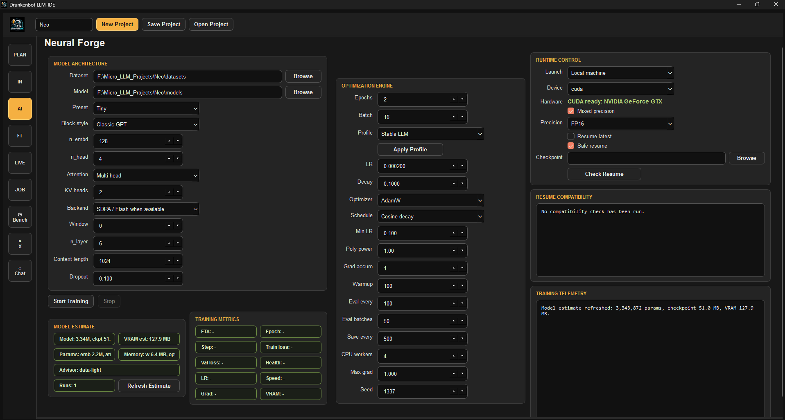
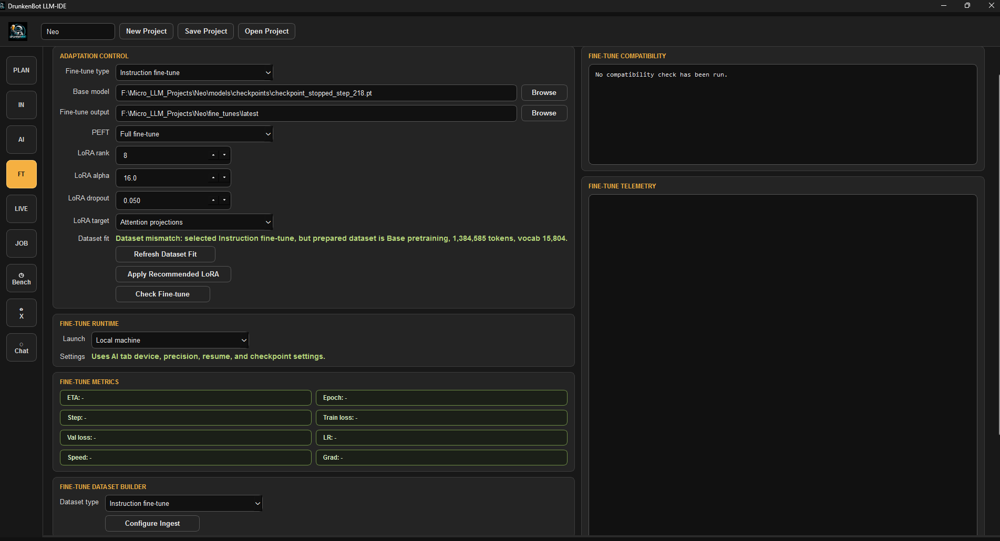
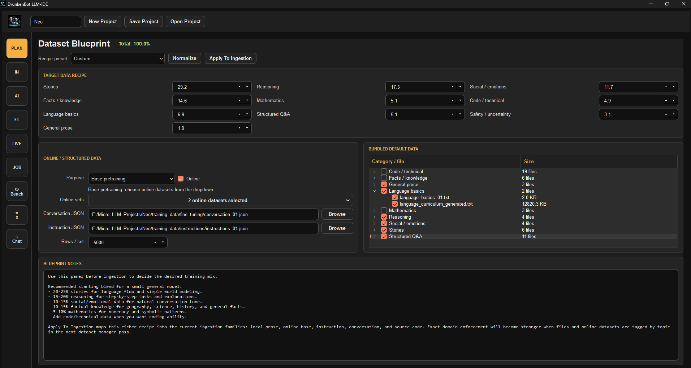
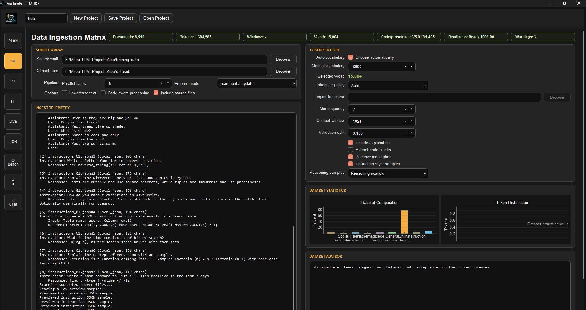

<p align="center">copyright @ DrunkenBot</p>

# DrunkenBot LLM-IDE

<p align="center">
  
  
</p>
<p align="center">
  
  
</p>

DrunkenBot LLM-IDE is a desktop app for preparing text/code datasets,
creating tokenizers, training small GPT-style language models, benchmarking
checkpoints, exporting model artifacts, and testing local GGUF models in a
streamed Markdown chat interface.


Requires Python 3.9 or newer.

Launch the desktop app:

```bash
python3 run_app.py
```

On startup, the IDE now runs a validation splash screen before the project
chooser opens. It checks log/cache/projects folders, verifies core imports, and
runs the repository unit tests. After all checks pass, you can choose to create
a new project or open an existing `project.json`.

On Linux/macOS, direct execution also needs:

```bash
chmod +x run_app.py
./run_app.py
```

If direct execution prints `Permission denied`, use `python3 run_app.py` or run
the `chmod` command above once after cloning.

## First backend commands

Prepare text/PDF/JSONL files:

```powershell
python -m llm_trainer.cli prepare --input_dir .\examples\tiny_corpus --output_dir .\runs\tiny_data --context_length 16
```

Prepare programming PDFs plus source files in code-aware mode:

```powershell
python -m llm_trainer.cli prepare --input_dir .\examples\tiny_corpus --output_dir .\runs\code_data --context_length 128 --code_training_mode
```

For large corpora, enable faster preview/build scanning:

```powershell
python -m llm_trainer.cli prepare --input_dir .\my_big_data --output_dir .\runs\big_data --fast_scan_mode
```

`--fast_scan_mode` uses cheaper file fingerprints and cached preview statistics,
which is significantly faster on very large datasets.

To reduce false duplicate matches in fast mode, add strict verification:

```powershell
python -m llm_trainer.cli prepare --input_dir .\my_big_data --output_dir .\runs\big_data --fast_scan_mode --strict_duplicate_verification --fast_scan_sample_bytes 65536
```

`--strict_duplicate_verification` only runs full SHA-256 hashing on suspected
fast-scan collisions, keeping scans fast while improving duplicate accuracy.

Code-aware mode keeps source-code files such as `.py`, `.js`, `.java`, `.cpp`,
`.cs`, `.go`, and `.rs`, preserves indentation, tags code/prose samples, and
tries to extract code-like blocks from PDFs/text.

Train a very small smoke-test model:

```powershell
python -m llm_trainer.cli train --data_dir .\runs\tiny_data --output_dir .\runs\tiny_model --epochs 1 --batch_size 2 --context_length 16 --embedding_size 32 --head_count 4 --layer_count 2 --device cpu --no_resume
```

Training saves checkpoints in the model folder and can resume from the latest
checkpoint by default. The UI exposes model options such as `n_embd`, `n_head`,
`n_layer`, context length, learning rate, batch size, warmup, checkpoint
interval, AMP, resume, and FP16 checkpoint quantization.

Prepared train/validation token arrays are now written as `train_tokens.npy` and
`val_tokens.npy` for faster load times and lower disk overhead than giant JSON
token lists. Existing `.json` token files are still supported as a fallback.

The Chat tab can load a `.gguf` model through `llama-cpp-python` and keep it in
memory for a ChatGPT-style local test chat with streamed, Markdown-rendered
replies. GPU offload is requested by default with `n_gpu_layers=-1`; install a
GPU-enabled llama-cpp-python build for actual CUDA/Metal acceleration.

For NVIDIA CUDA on Windows/Linux, first try the prebuilt CUDA wheel that matches
your CUDA runtime. Example for CUDA 12.4:

```bash
pip uninstall -y llama-cpp-python
pip install --no-cache-dir --force-reinstall llama-cpp-python --extra-index-url https://abetlen.github.io/llama-cpp-python/whl/cu124
```

Use `cu121`, `cu122`, `cu123`, `cu124`, `cu125`, `cu130`, or `cu132` to match
your installed CUDA version.

If you build from source instead, CUDA Toolkit must be installed and `nvcc` must
be on PATH:

```bash
pip uninstall -y llama-cpp-python
CMAKE_ARGS="-DGGML_CUDA=on" FORCE_CMAKE=1 pip install --no-cache-dir --force-reinstall llama-cpp-python
```

In PowerShell:

```powershell
pip uninstall -y llama-cpp-python
$env:CMAKE_ARGS="-DGGML_CUDA=on"
$env:FORCE_CMAKE="1"
pip install --no-cache-dir --force-reinstall llama-cpp-python
```

The app does not write fake GGUF files from native MicroGPT checkpoints. The
Export tab can run llama.cpp's `convert_hf_to_gguf.py` when the model folder
contains a real Hugging Face-compatible `hf_model` directory.

For MicroGPT checkpoints, use the HF-style package export first:

```bash
python -m llm_trainer.cli export-hf --model_dir runs/model
```

That creates `runs/model/hf_model` with config, weights, tokenizer metadata,
lineage, and a README. It is portable MicroGPT packaging, not a claim that the
checkpoint is already a llama.cpp-supported Llama/Mistral/Gemma model.

## Current IDE Features

- Dataset Blueprint with dynamic bundled corpus discovery.
- New projects copy the bundled default corpus into the project-local
  `training_data/` folder so each project can curate its own starting library.
- Dataset Blueprint categories are discovered from the project data folders and
  file names instead of being fixed to a static list.
- The Blueprint tree shows per-file size plus estimated token/vocabulary counts.
- Dataset Ingestion with source/document counts, token counts, train/validation
  windows, category charts, and token distribution charts.
- Dataset preparation now records corpus block diversity in `dataset_summary.json`
  and lowers the dataset rating when the final corpus is duplicate-heavy.
- Validation token splits are chunk-shuffled with a fixed seed so held-out loss
  samples the whole corpus instead of only the tail of `corpus.txt`.
- Architecture Advisor with parameter and memory breakdowns.
- Training Health Advisor for validation gaps, overfitting, and unstable loss.
- Best-validation checkpoint tracking via `checkpoint_best_val.pt`.
- Live Training Monitor with graph history persisted to SQLite.
- Fine-tuning Lab with LoRA support and compatibility checks.
- Job Manager groundwork for local, remote-worker, and RunPod-backed training.

When validation is enabled, the trainer saves a recommended checkpoint at
`checkpoints/checkpoint_best_val.pt` whenever validation loss improves. The final
training summary records both the final model path and the recommended
best-validation checkpoint.
