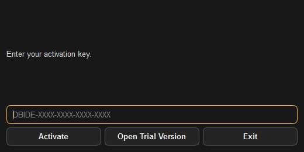

<div align="center">

# 🤖 DrunkenBot LLM-IDE
### The Complete Desktop Foundry for Training, Fine-Tuning, and Deploying Local Language Models

[](https://www.python.org/)
[](https://pytorch.org/)
[](https://www.qt.io/)
[](https://developer.nvidia.com/cuda-toolkit)
[](LICENSE.md)

<br/>

<p align="center">
  
  
</p>
<p align="center">
  
  
</p>

</div>

---

## 📖 Overview

**DrunkenBot LLM-IDE** is an end-to-end desktop development environment engineered to build, train, fine-tune, benchmark, export, and chat with custom generative language models entirely on local hardware—from raw documents to quantized `.gguf` binaries.

Unlike generic training scripts or opaque cloud platforms, DrunkenBot LLM-IDE provides a cohesive, hardware-adaptive desktop studio. It combines an isolated computational backend (`engine/`) with a responsive PySide6 desktop interface (`interface/`), featuring real-time training telemetry, prompt loss masking, multi-stage LoRA adaptation, process supervision, and integrated GGUF inference with reasoning controls.

---

## 🌟 Key Highlights & Capabilities

### 1. 📊 Visual Dataset Blueprint & Ingestion
- **Multi-Format Ingestion**: Ingest raw text (`.txt`), Markdown (`.md`), PDFs (`.pdf`), and structured dialogue/code (`.jsonl`).
- **Syntax-Preserving Code Mode**: Dedicated `clean_code` pipeline that preserves exact indentation, whitespace, and code fences for programming languages.
- **Custom BPE Tokenizer Engine**: Train custom Byte-Pair Encoding tokenizers with configurable vocabulary sizes (from 256 to 65,536+ tokens).
- **Target Loss Masking (`IGNORE_INDEX = -100`)**: Automatically masks system instructions and user queries during instruction, conversation, code, and tool-call preparation so the neural network trains strictly on assistant completions.
- **High-Performance Memory Mapping**: Pre-tokenized corpora are stored as binary NumPy arrays (`train_tokens.npy`, `train_targets.npy`) for sub-second dataset loading without RAM exhaustion.
- **Adaptive Diversity Filtering**: Built-in repetition and diversity filters that accept large technical books and monolithic codebases while rejecting synthetic template padding.

### 2. 🧠 Modern Neural Architecture ("Neural Forge")
- **Transformer Block Styles**: Classic GPT-style and modern LLaMA-style transformer blocks.
- **Rotary Position Embeddings (RoPE)**: High-precision positional encoding with configurable base $\theta$ ($10,000$ to $500,000$).
- **Attention Variety**: Multi-Head Attention (MHA), Grouped-Query Attention (GQA), Multi-Query Attention (MQA), and sliding-window attention.
- **Fast Compute Backends**: PyTorch Scaled Dot-Product Attention (SDPA) with automatic FlashAttention and memory-efficient kernel selection.
- **Normalization & Activations**: RMSNorm or standard LayerNorm with optional bias terms; GELU, SiLU, and SwiGLU feed-forward networks.

### 3. 🎯 Multi-Stage Fine-Tuning Lab
- **Specialized Workflows**:
  - **Base Pretraining**: Learn foundational language, grammar, and world knowledge from scratch.
  - **Instruction Fine-Tuning**: Align models to follow prompts and tasks (Alpaca, Dolly, SlimOrca).
  - **Conversation Fine-Tuning**: Multi-turn dialogue with turn-aware context pruning.
  - **Code Fine-Tuning**: Programming syntax, docstrings, and algorithm synthesis.
  - **Tool-Call Fine-Tuning**: Structured function calling and JSON output schemas.
- **Parameter-Efficient Fine-Tuning (PEFT / LoRA)**:
  - Low-Rank Adaptation ($W = W_0 + \frac{\alpha}{r} B A$).
  - Target either Attention projections (`q, k, v, out`) or full Attention + MLP blocks (`w1, w2, c_fc, c_proj`).
  - Auto-configured hyperparameter presets tuned to dataset scale and hardware.

### 4. ⚡ Hardware-Adaptive Training & Process Supervision
- **Dynamic VRAM Scaling**: Automatically probes host GPU capacity to calculate optimal micro-batch sizes and gradient accumulation steps.
- **Detached Worker Process**: The training worker runs in an independent operating system process. You can close the IDE, reopen it, or reboot the GUI without interrupting ongoing training runs.
- **Live SQLite Telemetry**: Batched streaming telemetry captures step-by-step training loss, validation loss, learning rate decay, tokens per second, and GPU memory utilization.
- **Mixed Precision**: Automatic Mixed Precision (AMP FP16 / BF16) with native gradient scaling.
- **Safe Resumption**: Checkpoints store optimizer states, RNG seeds, and step counters for bit-exact resumption.

### 5. 📦 Export Bay & Quantization
- **Full Model Bundling**: Consolidates PyTorch weights, tokenizer configs, and training lineage into standalone distribution packages.
- **FP16 & FP32 Quantization**: Halves memory footprint while preserving model fidelity.
- **HuggingFace Packaging**: Exports model architectures into standard Transformers-compatible directories (`config.json`, `model.safetensors`).
- **GGUF Conversion**: Compiles models directly into GGUF format (`f16`, `q8_0`, `q4_k_m`) for high-speed inference on CPU and Apple Silicon / CUDA via `llama.cpp`.

### 6. 💬 Interactive Streamed Chat
- **Embedded Inference**: Run local GGUF models directly within the desktop application using `llama-cpp-python`.
- **Streamed Markdown Rendering**: Rich formatting with live token-by-token streaming, code syntax highlighting, and copy buttons.
- **Reasoning / Thinking Controls**: Selectable reasoning effort profiles (`Light`, `Balanced`, `Deep`) for chain-of-thought exploration.
- **Hyperparameter Tuning**: Real-time control over temperature, top-p, top-k, repetition penalty, context window, and pinned system prompts.

### 7. 🔒 Machine-Bound Encrypted Licensing
- **Local-First Launch**: Startup checks local encrypted license metadata in ~1ms—no remote network lag and zero UI freeze.
- **Two-Layer Cryptography**: Fernet authenticated encryption (AES-128-CBC + HMAC-SHA256 keyed via PBKDF2 with machine ID and hardware MAC node) wrapped with **Windows DPAPI** (`CryptProtectData`).
- **Machine & User Bound**: Ciphertext is bound to the physical device and local Windows user credentials, preventing unauthorized license transfer.

---

## 🖼️ Visual Tour of the IDE

| Tab | Screen Preview | Core Purpose |
| :--- | :--- | :--- |
| **Dataset Blueprint** |  | Inspect, categorize, and verify source text, code, and PDF documents with estimated token counts. |
| **Data Ingestion** |  | Train custom BPE tokenizers, apply target loss masks, and compile fast binary `.npy` token streams. |
| **Neural Forge** |  | Configure model parameters (layers, heads, dimensions, RoPE, SDPA) and launch pretraining. |
| **Fine-Tuning Lab** |  | Select instruction, code, conversation, or tool-call adaptation with full fine-tune or LoRA. |
| **Live Telemetry** |  | Monitor real-time training and validation loss curves, hardware utilization, and step throughput. |
| **Job Manager** |  | Supervise background worker processes, view run manifests, inspect heartbeats, and reattach. |
| **Benchmarks** |  | Run standardized benchmark prompts across checkpoints to quantify perplexity and latency. |
| **Export Bay** |  | Export to SafeTensors, HuggingFace format, or quantize directly into GGUF (`Q4_K_M`, `Q8_0`). |
| **Chat Studio** |  | Test trained models in an interactive, streaming chat interface with reasoning and sampler controls. |
| **Activation** |  | Machine-bound cryptographic activation dialog for seamless offline and online licensing. |

---

## 🚀 Installation & Quickstart

### Prerequisites
- **Operating System**: Windows 10/11 (64-bit), Linux (Ubuntu 22.04+ recommended), or macOS (Apple Silicon).
- **Python**: Version **3.12** or newer.
- **GPU (Recommended)**: NVIDIA GPU with CUDA 12.x support (RTX 30xx/40xx/50xx or Data Center GPUs) for accelerated training. CPU training is fully supported for small models.

### Step 1: Clone the Repository
```bash
git clone https://github.com/drunkenbot-ai/LLM-IDE.git
cd LLM-IDE
```

### Step 2: Create & Activate Virtual Environment
```bash
# Windows (PowerShell)
python -m venv .venv
.\.venv\Scripts\Activate.ps1

# Linux / macOS
python3 -m venv .venv
source .venv/bin/activate
```

### Step 3: Install Dependencies
```bash
pip install --upgrade pip
pip install -r requirements.txt
```

> **Optional (CUDA Acceleration)**: If running an NVIDIA GPU, ensure your PyTorch build includes CUDA:
> ```bash
> pip install torch --index-url https://download.pytorch.org/whl/cu124
> ```

### Step 4: Launch DrunkenBot LLM-IDE
```bash
python run_app.py
```

On Linux or macOS, you can also make `run_app.py` directly executable:
```bash
chmod +x run_app.py
./run_app.py
```

On startup, the IDE executes a startup validation splash screen that verifies local cache directories, inspects core dependencies, and verifies repository integrity before presenting the Project Chooser.

---

## 💻 Headless CLI Interface

The non-Qt computational core can be executed directly from the terminal or in automated CI/CD pipelines without launching the graphical desktop interface:

```bash
# Display CLI help and available commands
python -m engine.cli --help
```

### 1. Ingest & Tokenize Data
```bash
# Prepare text/code files with prompt loss masking
python -m engine.cli prepare \
  --input_dir ./data/raw_corpus \
  --output_dir ./runs/prepared_data \
  --context_length 512 \
  --vocab_size 16384
```

### 2. Ingest Source Code
```bash
# Prepare programming language corpora with indentation preservation
python -m engine.cli prepare \
  --input_dir ./data/code_files \
  --output_dir ./runs/code_data \
  --context_length 1024 \
  --code_training_mode
```

### 3. Train a Model Headless
```bash
python -m engine.cli train \
  --data_dir ./runs/prepared_data \
  --output_dir ./runs/my_model \
  --epochs 3 \
  --batch_size 16 \
  --context_length 512 \
  --embedding_size 512 \
  --head_count 8 \
  --layer_count 6 \
  --device cuda
```

---

## 🏗️ Architecture & Project Structure

The codebase enforces a strict unidirectional dependency architecture:
- **`engine/`**: Pure computational Python/PyTorch modules. **Never** imports GUI or Qt code. Can be imported in scripts, notebooks, or CLI workers.
- **`interface/`**: PySide6 desktop application, widget assemblies, screen mixins, and reactive event loops.

```text
LLM-IDE/
├── engine/                          # Non-Qt Computational Backend
│   ├── config.py                    # Model, Dataset, and Training dataclass configs
│   ├── model.py                     # Transformer architecture (RoPE, GQA, SwiGLU, SDPA)
│   ├── tokenizer.py                 # BPE tokenizer training and streaming encoding
│   ├── target_masking.py            # Prompt loss masking (IGNORE_INDEX = -100)
│   ├── data_core.py                 # Dataset loading, indentation preservation, normalization
│   ├── dataset_corpus.py            # Corpus building, document chunking, diversity filter
│   ├── training_orchestrator.py     # Training loop, optimizer, loss computation, scheduler
│   ├── training_runtime.py          # Array chunking, dataset splits, checkpoint saving
│   ├── training_worker.py           # Standalone headless background worker process
│   ├── lora.py                      # Parameter-Efficient Fine-Tuning (LoRA) layers
│   ├── license_client.py            # Machine-bound encrypted licensing (DPAPI + Fernet)
│   ├── export.py                    # GGUF, SafeTensors, and HuggingFace exporters
│   ├── microgpt_chat.py             # Embedded PyTorch chat session with KV cache
│   └── llama_chat.py                # llama.cpp GGUF streamed chat wrapper
├── interface/                       # PySide6 Desktop Application
│   ├── app.py                       # Main application entry point and window lifecycle
│   ├── license_activation_dialog.py # Activation dialog and responsive background thread
│   ├── startup.py                   # Validation splash screen & project chooser
│   ├── core/                        # Window core mixin, project state, and menu logic
│   ├── screens/                     # Screen widgets (Dataset, Training, LoRA, Export, Chat)
│   ├── tabs/                        # Tab layouts and navigation adapters
│   └── widgets/                     # Custom UI controls, app shell, and metric cards
├── packaging/                       # Inno Setup and PyInstaller packaging scripts
├── ref/                             # High-resolution UI screenshots and artwork
├── tests/                           # 140+ comprehensive pytest test suites
├── README.md                        # Project landing page (this document)
├── Technical_Documentation.md       # Exhaustive technical specification & architecture
├── How to Train your LLM.md         # End-to-end user tutorial for building custom LLMs
└── pyproject.toml                   # Project metadata, dependencies, and tooling config
```

---

## 📦 Building Standalone Installers

To package DrunkenBot LLM-IDE into a self-contained Windows executable and Inno Setup installer that includes a private Python runtime:

```powershell
# Standard CPU / Generic Build
python packaging/packager.py

# CUDA-Enabled GPU Build (auto-probes installed NVIDIA drivers)
python packaging/packager.py --gpu
```

See [build.md](build.md) for full compilation prerequisites, Inno Setup configurations, and runtime profile details.

---

## 📚 Further Reading

- 📘 [How to Train your LLM.md](How%20to%20Train%20your%20LLM.md): The practical, step-by-step handbook for creating your first language model from scratch.
- 🔬 [Technical_Documentation.md](Technical_Documentation.md): In-depth architectural blueprint covering mathematical formulations, process supervisors, encrypted licensing, and algorithm implementations.
- ⚙️ [build.md](build.md): Build options, compiler settings, and standalone distribution instructions.

---

## 📄 License & Intellectual Property

Copyright © DrunkenBot. All rights reserved.  
See [LICENSE.md](LICENSE.md) for licensing terms and usage restrictions.
