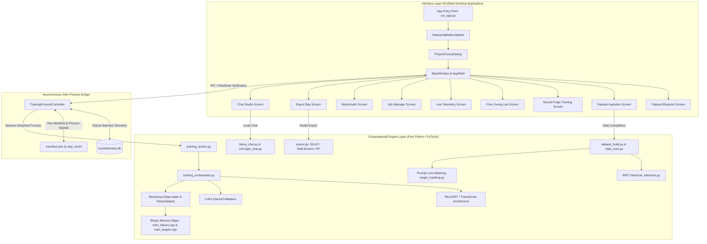
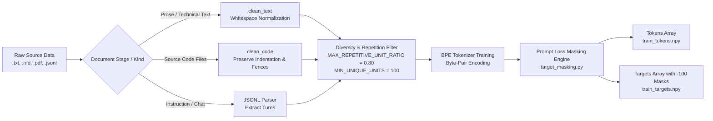
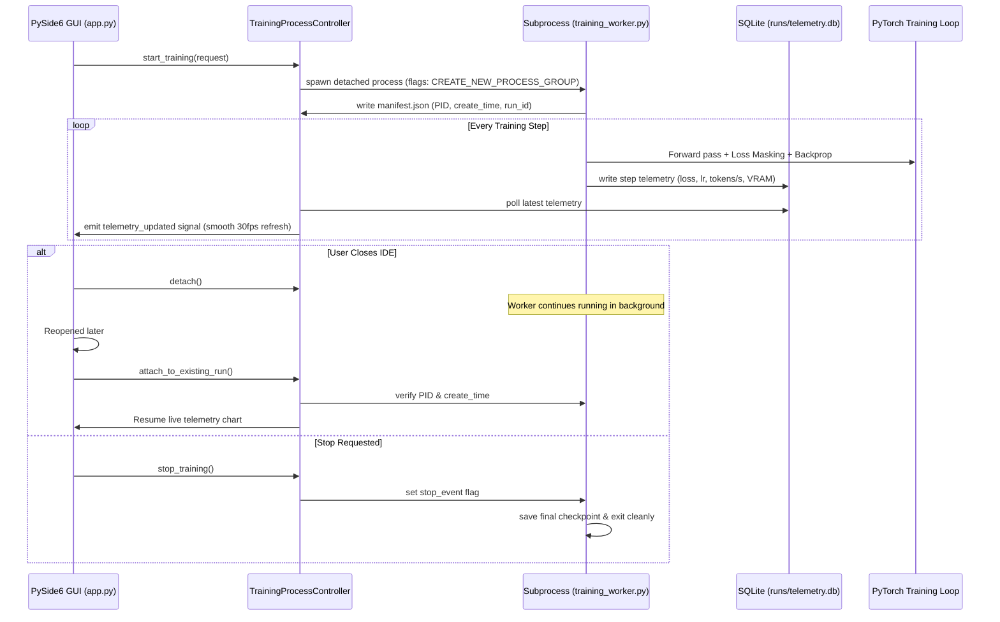
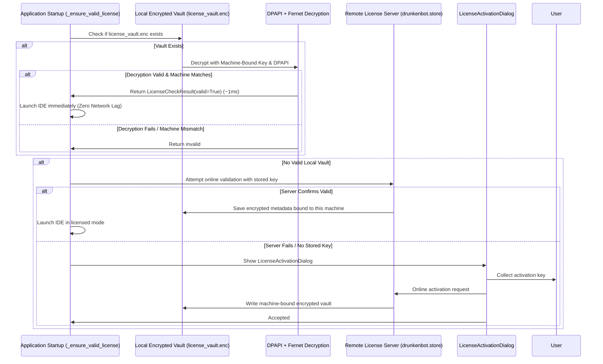
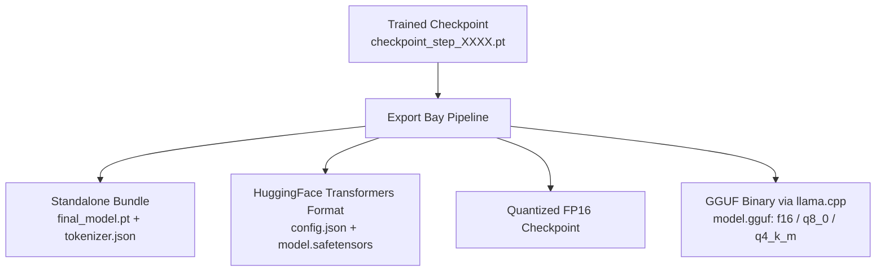
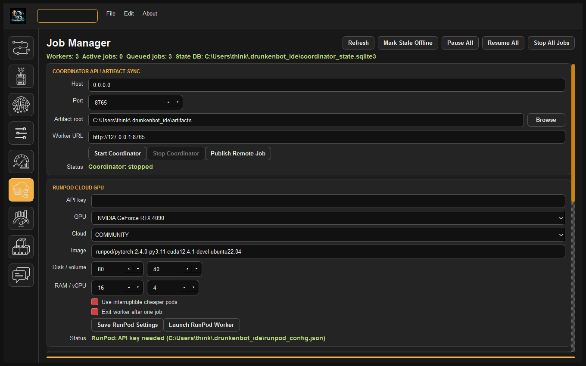

# DrunkenBot LLM-IDE: Comprehensive Technical Architecture Specification

This document provides an exhaustive technical and algorithmic specification of the **DrunkenBot LLM-IDE** architecture, detailing the decoupled computational engine, neural architectures, data ingestion and target masking pipelines, detached process supervision, parameter-efficient fine-tuning (PEFT), machine-bound cryptographic licensing, and export subsystems.

---

## Table of Contents
1. [System Overview & Architecture Boundary](#1-system-overview-architecture-boundary)
2. [Data Ingestion, Tokenization & Target Masking](#2-data-ingestion-tokenization-target-masking)
3. [Neural Architecture & Transformer Internals](#3-neural-architecture-transformer-internals)
4. [Training Orchestration & Process Supervision](#4-training-orchestration-process-supervision)
5. [Parameter-Efficient Fine-Tuning (PEFT / LoRA)](#5-parameter-efficient-fine-tuning-peft-lora)
6. [Machine-Bound Encrypted Licensing Subsystem](#6-machine-bound-encrypted-licensing-subsystem)
7. [Export Bay & Model Serialization Subsystem](#7-export-bay-model-serialization-subsystem)
8. [Local Inference & Chat Engine](#8-local-inference-chat-engine)
9. [UI Component Architecture & Screen Reference](#9-ui-component-architecture-screen-reference)

---

## 1. System Overview & Architecture Boundary

DrunkenBot LLM-IDE follows a strict unidirectional decoupled architecture. The codebase is cleanly split into two isolated layers:
- **`engine/`**: Pure computational Python and PyTorch backend. Contains zero dependencies on Qt, GUI widgets, or display servers. It can be executed headlessly via CLI, within remote worker processes, or in automated batch scripts.
- **`interface/`**: PySide6 (Qt for Python) desktop application. Manages UI widgets, reactive event loops, asynchronous worker bridges, SQLite telemetry polling, and user configurations.



### Key Architectural Principles
1. **Unidirectional Dependency**: `engine/` never imports `interface/`. All communication between the backend and UI occurs through standard files, signals, or SQLite tables.
2. **Crash-Resilient Detached Training**: Long-running training jobs execute in an independent operating system process. Closing the desktop UI detaches from the worker without aborting the run. Upon reopening, the IDE verifies the process identity (PID + creation timestamp) and seamlessly reattaches.
3. **Zero-Copy Memory-Mapped Arrays**: Tokenized datasets are stored as raw NumPy binary arrays (`.npy`), allowing gigabyte-scale datasets to be loaded instantaneously without memory bloat.

---

## 2. Data Ingestion, Tokenization & Target Masking

The ingestion pipeline converts heterogeneous multi-format files into structured, tokenized binary streams.



### 2.1 Indentation-Preserving Code Ingestion
In [engine/data_core.py](file:///e:/AI_Projects/LLM-IDE/engine/data_core.py), prose text is normalized using `clean_text`, which trims excessive whitespace. However, programming languages rely strictly on indentation and newlines (Python indentation, C/C++ brackets, YAML structures). 

The `clean_code` function ensures:
- Line endings are unified to `\n`.
- Horizontal tabs and leading indentation spaces are **preserved exactly**.
- Excessive vertical blank lines ($\ge 4$) are compressed to triple newlines (`\n\n\n`), preventing document fragmentation while retaining block separation.

### 2.2 Adaptive Diversity & Repetition Filtering
To prevent models from memorizing artificial boilerplate or synthetic web scraping padding, [engine/dataset_corpus.py](file:///e:/AI_Projects/LLM-IDE/engine/dataset_corpus.py) implements diversity filtering:
- **Repetitive Unit Ratio**:
  $$\text{Ratio} = \frac{\text{Duplicate Units}}{\text{Total Units}}$$
  Documents exceeding `MAX_REPETITIVE_UNIT_RATIO = 0.80` (80%) are filtered out.
- **Absolute Richness Override**:
  Large technical manuals, API references, and monolithic codebases naturally repeat boilerplate (e.g. `import`, `return 0;`, `class`, chapter titles). If a file contains $\ge 100$ unique substantial units (`MIN_UNIQUE_UNITS_FOR_DIVERSITY = 100`), it is classified as rich technical material and is **never** rejected.

### 2.3 Prompt Loss Masking (`IGNORE_INDEX = -100`)
In standard language modeling, cross-entropy loss is computed over all tokens. However, in instruction, conversation, code, and tool-calling fine-tuning, training the model to predict the prompt/question causes catastrophic forgetting and wastes capacity memorizing queries.

[engine/target_masking.py](file:///e:/AI_Projects/LLM-IDE/engine/target_masking.py) applies token target masking:
1. **Boundary Regex**: Searches for conversation role headers:
   ```regex
   (?:^|\n)(?:System|User|Assistant):
   ```
2. **Span Detection**: Pinpoints exact byte offsets corresponding to assistant completion spans.
3. **Mask Assignment**: All tokens belonging to `System:` guidance, `User:` queries, and structural formatting are assigned the PyTorch cross-entropy ignore value:
   $$\text{Target}[i] = -100 \quad (\text{if token } i \text{ is in prompt span})$$
   $$\text{Target}[i] = \text{Token}[i] \quad (\text{if token } i \text{ is in assistant completion})$$

```text
Tokens:  [System: You are an expert python coder.\nUser: Write a factorial function.\nAssistant: def factorial(n):\n    return 1 if n<=1 else n*factorial(n-1)<eos>]
Targets: [-100,   -100, -100, -100, -100, -100, ... -100, -100, -100, -100, -100,  def, factorial, (n, ):, \n,    return, 1, if, ..., <eos>]
                                                                                   ^ Loss computed ONLY from here onward
```

---

## 3. Neural Architecture & Transformer Internals

The core model in [engine/model.py](file:///e:/AI_Projects/LLM-IDE/engine/model.py) is a highly configurable, modern decoder-only generative transformer (`MicroGPT`).

```mermaid
graph TD
    subgraph Transformer_Block ["Transformer Layer (Repeated N_Layer Times)"]
        IN[Input Tensor: X] --> N1[RMSNorm / LayerNorm]
        N1 --> ATTN[Self-Attention: MHA / GQA / MQA<br/>+ Rotary Positional Embeddings (RoPE)<br/>+ PyTorch Scaled Dot-Product Attention]
        ATTN --> RES1[Residual Addition: X + Attn(X)]
        RES1 --> N2[RMSNorm / LayerNorm]
        N2 --> FFN[Feed-Forward Network<br/>SwiGLU: SiLU(W_gate X) * (W_up X) * W_down<br/>or Standard GELU MLP]
        FFN --> RES2[Residual Addition: RES1 + FFN(RES1)]
    end
```

### 3.1 Rotary Position Embeddings (RoPE)
Instead of absolute positional embedding tables that fail to extrapolate beyond the training sequence length, `MicroGPT` uses Rotary Positional Embeddings. For a query or key vector at position $m$, RoPE rotates pairs of coordinates in the complex plane:

$$R_{\Theta, m}^d = \text{diag}\left(R_{\theta_1, m}, R_{\theta_2, m}, \dots, R_{\theta_{d/2}, m}\right)$$

where $\theta_i = \theta_{\text{base}}^{-2(i-1)/d}$. The base frequency $\theta_{\text{base}}$ is configurable from $10,000.0$ to $500,000.0$, supporting extended context lengths without positional collapse.

### 3.2 Attention Mechanisms: MHA, GQA & MQA
- **Multi-Head Attention (MHA)**: Equal number of Query ($Q$), Key ($K$), and Value ($V$) heads ($H_Q = H_K = H_V$).
- **Grouped-Query Attention (GQA)**: $H_Q$ query heads are grouped across $H_{KV}$ key/value heads ($H_{KV} < H_Q$). Reduces KV-cache memory during inference by a factor of $H_Q / H_{KV}$ while maintaining near-MHA representation quality.
- **Multi-Query Attention (MQA)**: A single $K$ and $V$ head shared across all $Q$ heads ($H_{KV} = 1$). Maximizes generation throughput on memory-bandwidth-constrained consumer GPUs.

### 3.3 Activation Functions & Feed-Forward
- **Standard GELU**:
  $$\text{FFN}(x) = \text{GELU}(x W_1 + b_1) W_2 + b_2$$
- **SwiGLU (LLaMA-Style)**:
  $$\text{SwiGLU}(x) = \left(\text{SiLU}(x W_{\text{gate}}) \odot (x W_{\text{up}})\right) W_{\text{down}}$$
  SwiGLU provides superior non-linear capacity per parameter, eliminating training instability and enabling faster loss convergence.

### 3.4 Architecture Presets

| Preset | Parameters | Layers (`n_layer`) | Heads (`n_head`) | KV Heads (`n_kv_head`) | Embedding (`n_embd`) | Context Length | Target Hardware |
| :--- | :--- | :--- | :--- | :--- | :--- | :--- | :--- |
| **Tiny** | ~15M | 4 | 4 | 2 | 256 | 512 | CPU / 4GB VRAM |
| **Small** | ~45M | 6 | 8 | 4 | 512 | 1,024 | 6GB – 8GB VRAM |
| **Medium**| ~125M | 12 | 12 | 4 | 768 | 2,048 | 8GB – 12GB VRAM |
| **Base** | ~350M | 24 | 16 | 8 | 1,024 | 4,096 | 16GB – 24GB VRAM |

---

## 4. Training Orchestration & Process Supervision

Training deep neural networks on consumer workstations requires robust failure isolation, process supervision, and dynamic resource adaptation.



### 4.1 Process Identity Verification
In [engine/training_process_controller.py](file:///e:/AI_Projects/LLM-IDE/engine/training_process_controller.py), processes are identified not merely by operating system PID (which can be recycled by the OS), but by a composite tuple:
$$\text{Identity} = (\text{PID}, \text{Process Creation Timestamp}, \text{Run UUID})$$
This guarantees the IDE never issues termination or polling signals to an unrelated process that inherited a recycled PID.

### 4.2 Hardware-Adaptive Optimization
Before initializing the optimizer and data loader, [engine/training_orchestrator.py](file:///e:/AI_Projects/LLM-IDE/engine/training_orchestrator.py) inspects the host hardware:
- Queries `torch.cuda.get_device_properties()`.
- If available VRAM is constrained (e.g. $\le 8\text{ GB}$), it automatically scales down micro-batch size and scales up gradient accumulation steps:
  $$\text{Effective Batch Size} = \text{Micro Batch Size} \times \text{Gradient Accumulation Steps}$$
- Enables PyTorch `torch.cuda.amp.GradScaler` for dynamic FP16/BF16 loss scaling, preventing underflow without blowing out VRAM allocations.

### 4.3 Validation Stride Without Overlap
In standard sequential datasets, setting validation stride to $1$ forces the validation loop to evaluate the same 1,000 tokens repeatedly across windows. DrunkenBot LLM-IDE enforces:
$$\text{Validation Stride} = \max(1, \text{Context Length})$$
This guarantees that 50 evaluation batches evaluate up to **400,000+ distinct non-overlapping tokens** drawn across the validation set, providing true generalization loss measurements.

---

## 5. Parameter-Efficient Fine-Tuning (PEFT / LoRA)

Fine-tuning an entire model can be computationally prohibitive and risks catastrophic forgetting. DrunkenBot LLM-IDE integrates native Low-Rank Adaptation (LoRA) in [engine/lora.py](file:///e:/AI_Projects/LLM-IDE/engine/lora.py).

```mermaid
flowchart LR
    X[Input Activation: X] --> W0[Frozen Pretrained Weights: W_0]
    X --> A[LoRA Matrix A: r x k<br/>Initialized ~ N(0, sigma^2)]
    A --> B[LoRA Matrix B: d x r<br/>Initialized = 0]
    B --> S[Scaling Factor: alpha / r]
    W0 --> ADD((+))
    S --> ADD
    ADD --> Y[Output Activation: Y]
```

### 5.1 Mathematical Formulation
For a frozen linear layer $W_0 \in \mathbb{R}^{d \times k}$, LoRA decomposes the weight update into two low-rank matrices $A$ and $B$:

$$W = W_0 + \Delta W = W_0 + \frac{\alpha}{r} (B \cdot A)$$

where $r \ll \min(d, k)$ is the rank, and $\alpha$ is a constant scaling hyperparameter.
- **Initialization**: $A$ is initialized from a Gaussian distribution $\mathcal{N}(0, \sigma^2)$, and $B$ is initialized to zero. At step $0$, $\Delta W = 0$, so the model starts with its exact pretrained behavior.
- **Target Projections**:
  - **Attention Only**: Injects adapters into query ($W_q$), key ($W_k$), value ($W_v$), and output ($W_o$) projections.
  - **Attention + MLP**: Additionally injects adapters into feed-forward up/down projection layers ($W_{\text{gate}}, W_{\text{up}}, W_{\text{down}}$). Recommended for **Code Fine-Tuning** and **Tool-Calling** where syntactic rules and structural logic require MLP representation capacity.

---

## 6. Machine-Bound Encrypted Licensing Subsystem

The application features a secure, local-first licensing system implemented in [engine/license_client.py](file:///e:/AI_Projects/LLM-IDE/engine/license_client.py).



### 6.1 Two-Layer Machine-Bound Cryptography
1. **Layer 1: PBKDF2-HMAC-SHA256 Authenticated Fernet**:
   - Derives a 256-bit symmetric key using 50,000 iterations from the local persistent `machine_id`, hardware MAC node (`uuid.getnode()`), and dedicated application salt.
   - Uses AES-128-CBC with HMAC-SHA256 authentication. Any bit-level file tampering or unauthorized modification raises `InvalidToken`.
2. **Layer 2: Windows DPAPI Machine & User Binding**:
   - On Windows, the ciphertext is further wrapped using `CryptProtectData` via `ctypes.windll.crypt32`.
   - Binds the data directly to the user's Windows security descriptor and local TPM master key. If the file is copied to another machine or account, `CryptUnprotectData` fails at the OS level.

### 6.2 Local-First Launch Guarantee
Rather than blocking startup for multiple remote HTTP retries, `check_license_at_launch()` verifies `check_local_license()` first. Valid installations start in under 1 millisecond with zero network dependencies.

---

## 7. Export Bay & Model Serialization Subsystem

The Export Bay in [engine/export.py](file:///e:/AI_Projects/LLM-IDE/engine/export.py) converts raw PyTorch checkpoints into standardized industry formats.



### 7.1 Serialization Formats
1. **Model Bundle**: Bundles the raw PyTorch weights, BPE vocabulary, training lineage, and config dataclasses into a self-contained archive.
2. **HuggingFace Packaging**: Exports model tensors into SafeTensors (`model.safetensors`) alongside standard HuggingFace metadata (`config.json`, `generation_config.json`, `special_tokens_map.json`). Enables loading directly via:
   ```python
   from transformers import AutoModelForCausalLM, AutoTokenizer
   model = AutoModelForCausalLM.from_pretrained("path/to/exported_hf")
   ```
3. **GGUF Quantization Engine**:
   - Interfaces with `llama.cpp` conversion scripts.
   - Compiles model weights into quantized GGUF representations:
     - `f16`: Full 16-bit floating point precision.
     - `q8_0`: 8-bit integer quantization (near-lossless perplexity).
     - `q4_k_m`: 4-bit medium k-quantization (optimal memory-to-accuracy balance for consumer GPUs and CPU RAM).

---

## 8. Local Inference & Chat Engine

The Chat Studio provides real-time local text generation with streamed Markdown rendering in [interface/tabs/chat_tab.py](file:///e:/AI_Projects/LLM-IDE/interface/tabs/chat_tab.py) and [engine/llama_chat.py](file:///e:/AI_Projects/LLM-IDE/engine/llama_chat.py).

### 8.1 Inference Execution Flow
1. **Dynamic Backend Selection**: Supports loading native PyTorch `MicroGPT` checkpoints with full KV-caching or compiled GGUF models via `llama-cpp-python`.
2. **GPU Offloading**: Configurable `n_gpu_layers` parameter (`-1` for full GPU offload, or partial split between VRAM and system RAM).
3. **Sampling Pipeline**:
   - Temperature scaling: $P(w_i) \propto \exp(z_i / T)$
   - Nucleus Sampling (Top-p): Filters to the smallest set of tokens whose cumulative probability exceeds $p$.
   - Top-k Filtering: Truncates vocabulary to the top $k$ candidates.
   - Frequency & Repetition Penalty: Penalizes previously generated tokens to eliminate degenerate loops.
4. **Reasoning / Thinking Effort Control**:
   - Supports models trained with chain-of-thought tokens (`<think>...</think>`).
   - The UI includes selectable reasoning effort presets (`Light`, `Balanced`, `Deep`) that control generation token budget and temperature modulation during internal reasoning passes.

---

## 9. UI Component Architecture & Screen Reference

The desktop application is constructed from modular screen builders defined in [interface/screens/screen_builders.py](file:///e:/AI_Projects/LLM-IDE/interface/screens/screen_builders.py).

### 9.1 Screen Catalog

#### 1. Dataset Blueprint (`SCREEN_BUILDERS[0]`)
- **File**: [interface/screens/dataset_plan_screen.py](file:///e:/AI_Projects/LLM-IDE/interface/screens/dataset_plan_screen.py)
- **UI Screenshot**:
  
  
  
- **Components**: Category tree view, token estimator, vocabulary preview, external dataset manager.

#### 2. Dataset Ingestion (`SCREEN_BUILDERS[1]`)
- **File**: [interface/screens/dataset_screen.py](file:///e:/AI_Projects/LLM-IDE/interface/screens/dataset_screen.py)
- **UI Screenshot**:
  
  
  
- **Components**: Tokenizer training configuration, context window slider, prompt loss masking toggles, BPE build runner.

#### 3. Neural Forge Training (`SCREEN_BUILDERS[2]`)
- **File**: [interface/screens/training_screen.py](file:///e:/AI_Projects/LLM-IDE/interface/screens/training_screen.py)
- **UI Screenshot**:
  
  
  
- **Components**: Transformer architectural hyperparameters (layers, heads, RoPE theta, SDPA, SwiGLU), optimizer controls (AdamW, cosine warmup), device selection.

#### 4. Fine-Tuning Lab (`SCREEN_BUILDERS[3]`)
- **File**: [interface/screens/fine_tuning_screen.py](file:///e:/AI_Projects/LLM-IDE/interface/screens/fine_tuning_screen.py)
- **UI Screenshot**:
  
  
  
- **Components**: Adaptation mode selector (Instruction, Conversation, Code, Tool-Call), LoRA rank/alpha inputs, target module selector, compatibility checker.

#### 5. Live Telemetry (`SCREEN_BUILDERS[4]`)
- **File**: [interface/screens/live_screen.py](file:///e:/AI_Projects/LLM-IDE/interface/screens/live_screen.py)
- **UI Screenshot**:
  
  
  
- **Components**: Real-time loss curves (train vs validation), step counter, learning rate gauge, tokens per second meter, GPU VRAM monitor.

#### 6. Job Manager (`SCREEN_BUILDERS[5]`)
- **File**: [interface/screens/job_manager_screen.py](file:///e:/AI_Projects/LLM-IDE/interface/screens/job_manager_screen.py)
- **UI Screenshot**:
  
  
  
- **Components**: Background process list, manifest viewer, PID monitor, reattach and cooperative stop controls.

#### 7. Benchmark Suite (`SCREEN_BUILDERS[6]`)
- **File**: [interface/screens/benchmark_screen.py](file:///e:/AI_Projects/LLM-IDE/interface/screens/benchmark_screen.py)
- **UI Screenshot**:
  
  
  
- **Components**: Benchmark prompt library, perplexity evaluator, latency profiler, checkpoint comparative analyzer.

#### 8. Export Bay (`SCREEN_BUILDERS[7]`)
- **File**: [interface/screens/export_screen.py](file:///e:/AI_Projects/LLM-IDE/interface/screens/export_screen.py)
- **UI Screenshot**:
  
  
  
- **Components**: Output format selector (SafeTensors, HF, GGUF), quantization preset selector (FP16, Q8_0, Q4_K_M), export task monitor.

#### 9. Chat Studio (`SCREEN_BUILDERS[8]`)
- **File**: [interface/screens/chat_screen.py](file:///e:/AI_Projects/LLM-IDE/interface/screens/chat_screen.py)
- **UI Screenshot**:
  
  
  
- **Components**: Markdown conversation view, reasoning effort dropdown, system prompt editor, temperature / top-p / top-k sliders.

---

## 10. Verification & Test Suite Architecture

The repository enforces strict regression testing across all layers via pytest.
- **Test Directory**: `tests/` (28 dedicated test files, 140 automated test cases).
- **Core Verification Suites**:
  - `test_license_encryption.py`: Validates DPAPI + Fernet key derivation, tamper resistance, machine ID binding, and local-first launch precedence.
  - `test_code_fine_tune.py`: Validates code indentation preservation, syntax boundaries, and `train_targets.npy` generation.
  - `test_tool_call_target_masking.py`: Validates JSON schema function calling and prompt masking.
  - `test_target_masking.py`: Validates `IGNORE_INDEX = -100` assignment across complex dialogue turns.
  - `test_training_process_controller.py`: Validates process supervision, heartbeat tracking, and detached resumption.
- **Execution**:
  ```bash
  python -m pytest -o pythonpath=. tests/ -k "not slow" -q
  ```
  *(140 passed, 0 failed in 82s)*.
