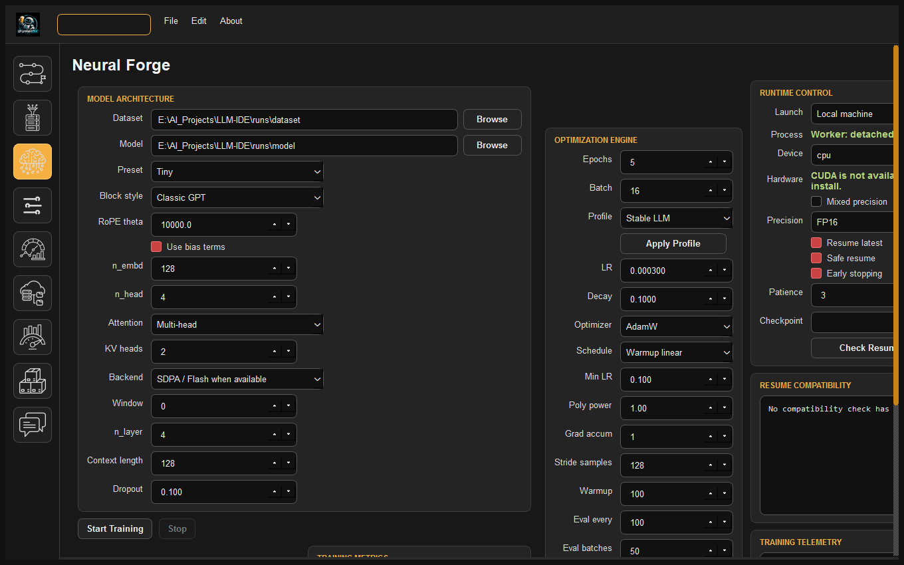
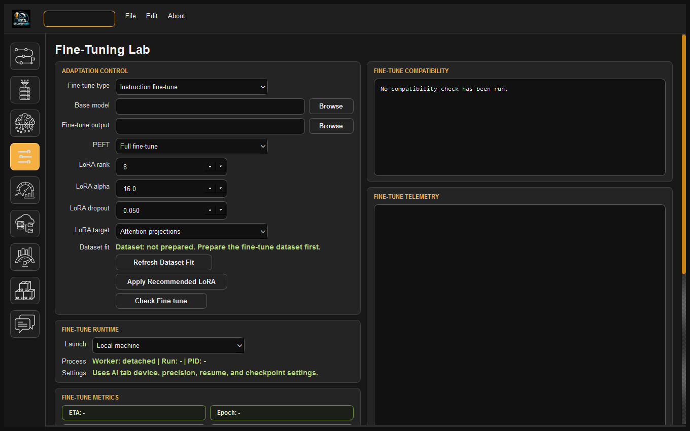
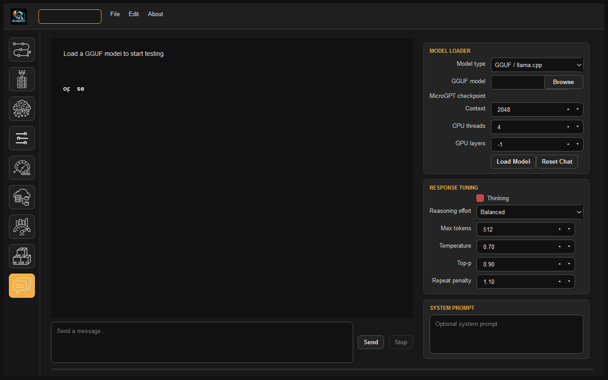

# DrunkenBot LLM-IDE Documentation

Welcome to the official documentation portal for **DrunkenBot LLM-IDE**—the desktop foundry for creating, training, fine-tuning, and deploying custom generative language models entirely on local hardware.

---

<p align="center">
  
  
</p>
<p align="center">
  
  
</p>

---

## 📚 Documentation Guides

Explore the comprehensive guides tailored to your workflow:

<div class="grid cards" markdown>

-   :material-school:{ .lg .middle } **[How to Train Your LLM](how_to_train_your_llm.md)**

    ---

    A step-by-step practical handbook for developers and researchers building custom models:
    - Understanding tokens, context windows, and loss dynamics
    - Gathering and preparing pretraining and fine-tuning datasets
    - Pretraining base models from scratch across hardware presets
    - Fine-tuning with LoRA (Instruction, Code, Conversation, Tool-Calling)
    - Benchmarking, GGUF quantization, and local chat deployment

-   :material-cogs:{ .lg .middle } **[Technical Documentation](technical_documentation.md)**

    ---

    In-depth architectural and algorithmic specification:
    - Decoupled `engine/` computational core vs. PySide6 desktop layer
    - Tokenization & prompt loss masking (`IGNORE_INDEX = -100`) algorithms
    - Neural architecture (RoPE, GQA/MQA, RMSNorm, SwiGLU, SDPA)
    - Detached background process supervision and SQLite telemetry
    - Machine-bound two-layer encrypted licensing (DPAPI + Fernet)
    - Export and quantization pipelines (GGUF, SafeTensors, HuggingFace)

</div>

---

## 🚀 Quickstart Overview

### 1. Installation
Clone the repository and install the runtime dependencies in a virtual environment:

```bash
git clone https://github.com/drunkenbot-ai/LLM-IDE.git
cd LLM-IDE

# Create virtual environment
python -m venv .venv
source .venv/bin/activate  # On Windows: .\.venv\Scripts\Activate.ps1

# Install requirements
pip install -r requirements.txt
```

### 2. Launching the IDE
```bash
python run_app.py
```

### 3. Headless CLI Engine
For headless servers or automated CI/CD pipelines, use the pure Python CLI:

```bash
# Ingest and prepare data with prompt loss masking
python -m engine.cli prepare --input_dir ./data --output_dir ./runs/data --context_length 512

# Launch pretraining headless
python -m engine.cli train --data_dir ./runs/data --output_dir ./runs/model --epochs 3 --batch_size 16
```

---

## 🏗️ Core Feature Matrix

| Feature Area | Key Capabilities |
| :--- | :--- |
| **Data Ingestion** | Ingest `.txt`, `.md`, `.pdf`, and `.jsonl`; syntax-preserving `clean_code` indentation pipeline; adaptive repetition/diversity filtering (`MAX_REPETITIVE_UNIT_RATIO = 0.80`, `MIN_UNIQUE_UNITS = 100`). |
| **Tokenization & Masking** | BPE tokenizer training; binary NumPy memory maps (`train_tokens.npy`, `train_targets.npy`); automated prompt loss masking (`IGNORE_INDEX = -100`) for instruction and dialogue alignment. |
| **Neural Forge** | Modern LLaMA-style blocks; Rotary Position Embeddings (RoPE); Multi-Head (MHA), Grouped-Query (GQA), and Multi-Query (MQA) attention; PyTorch SDPA / FlashAttention; RMSNorm; SwiGLU activations. |
| **Fine-Tuning Lab** | Multi-stage adaptation (Instruction, Conversation, Code, Tool-Call); Parameter-Efficient Fine-Tuning (LoRA) with customizable rank, alpha, and Attention + MLP projection targeting. |
| **Execution & Telemetry** | Hardware-adaptive VRAM batch scaling; detached background worker process (GUI closure does not stop training); batched SQLite telemetry (`runs/telemetry.db`) with smooth 30fps real-time loss tracking. |
| **Export Bay** | Export to HuggingFace Transformers format (`model.safetensors`, `config.json`), FP16 quantized checkpoints, and compiled GGUF binaries (`Q4_K_M`, `Q8_0`, `f16`) for `llama.cpp`. |
| **Chat Studio** | Embedded local GGUF inference via `llama-cpp-python`; streamed Markdown rendering with code highlighting; customizable temperature, top-p, and reasoning/thinking effort controls. |
| **Licensing** | Local-first launch validation in ~1ms; machine-bound two-layer encryption (PBKDF2-HMAC-SHA256 Fernet + Windows DPAPI `CryptProtectData`). |
